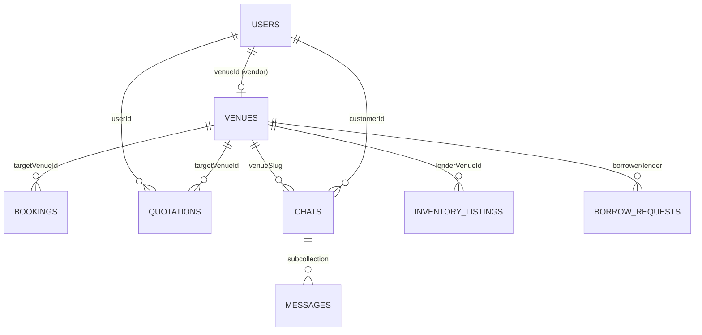

# Festalytics — Engineering Architecture

> **Last updated:** May 2026  
> **Stack:** Next.js 16 · React 19 · Firebase · FastAPI (Python)

---

## Table of Contents

1. [Overview](#1-overview)
2. [Technology Stack](#2-technology-stack)
3. [Folder Structure](#3-folder-structure)
4. [Routing Blueprint](#4-routing-blueprint)
5. [Authentication & Security](#5-authentication--security)
6. [Data Flow & State Management](#6-data-flow--state-management)
7. [Firestore Data Model](#7-firestore-data-model)
8. [API & Backend Services](#8-api--backend-services)
9. [Environment Variables](#9-environment-variables)
10. [Local Development](#10-local-development)


---

## 1. Overview

Festalytics is a **wedding/event planning platform** with three product surfaces:

| Surface | Audience | Auth |
|---------|----------|------|
| **B2C Consumer** | Event planners, couples | Firebase Auth (`role: user`) |
| **B2B Vendor ERP** | Venue owners (e.g. Zaydan Banquet Hall) | Firebase Auth (`role: vendor`) + `venueId` tenant |
| **Super Admin** | Platform operators | Separate cookie session (not Firebase) |

**Architecture pattern:** Next.js App Router frontend + Firebase (auth, Firestore, storage) + Python FastAPI microservice for AI/voice on port `8001`.

```
┌──────────────┐     ┌─────────────────┐     ┌──────────────────┐
│   Browser    │────▶│  Next.js :3000  │────▶│  Firebase        │
│              │     │  (pages + API)  │     │  Auth/Firestore  │
└──────────────┘     └────────┬────────┘     └──────────────────┘
                              │
                              ▼
                     ┌─────────────────┐
                     │ FastAPI :8001   │
                     │ RAG · CLIP ·    │
                     │ Twilio Voice    │
                     └─────────────────┘
```

---

## 2. Technology Stack

### Frontend (`package.json`)

| Package | Version | Role |
|---------|---------|------|
| **next** | latest (16.x) | App Router, SSR/CSR, API route handlers |
| **react** / **react-dom** | 19.x | UI runtime |
| **tailwindcss** | 4.x | Utility-first CSS |
| **firebase** | 12.x | Client Auth, Firestore, Storage |
| **firebase-admin** | 13.x | Server-side admin API (bypasses Firestore rules) |
| **googleapis** | 173.x | Google Sheets (live bookings, calling sheet) |
| **framer-motion** | 12.x | UI animations |
| **leaflet** + **react-leaflet** | — | Venue maps |
| **react-dropzone** | — | Image uploads (Find Decor, galleries) |
| **lucide-react** / **react-icons** | — | Icons |
| **xlsx** | — | Excel tooling |

### Config files

| File | Purpose |
|------|---------|
| `next.config.js` | `reactStrictMode: true` |
| `jsconfig.json` | Path alias `@/*` → `src/*` |
| `postcss.config.mjs` | Tailwind PostCSS |
| `firestore.rules` | Firestore RBAC |
| `firestore.indexes.json` | Composite indexes |
| `firebase.json` | Firebase project config |
| `.env.local` | Next.js secrets |
| `backend/.env` | Python AI/Twilio secrets |

### Python backend (`backend/`)

| Package | Role |
|---------|------|
| FastAPI + Uvicorn | HTTP API on `:8001` |
| Groq | LLM (RAG, vision, Twilio decisions) |
| scikit-learn, rank_bm25, pandas | RAG retrieval |
| PyTorch + CLIP | Decor image matching |
| Twilio | Voice confirmation calls |
| Pillow | Image processing |

---

## 3. Folder Structure

```
festalytics/
├── app/                         # Next.js App Router
│   ├── layout.jsx               # Root → Providers → AuthProvider
│   ├── providers.jsx
│   ├── page.jsx                 # Landing (/)
│   ├── (B2C public pages)
│   ├── user-dashboard/          # Consumer authenticated
│   ├── vendor-dashboard/        # B2B ERP shell
│   ├── admin/                   # Super-admin panel
│   └── api/                     # Next.js Route Handlers (BFF)
│
├── src/
│   ├── components/              # UI by domain
│   │   ├── vendor/              # ERP components
│   │   ├── admin/               # Admin shell, tables
│   │   ├── auth/                # AuthGate modal
│   │   ├── ai-planner/          # RAG chat UI
│   │   └── find-my-decor/       # CLIP matcher UI
│   ├── context/                 # AuthContext
│   ├── contexts/                # VendorSearchContext
│   ├── hooks/                   # Data-fetching hooks
│   ├── lib/
│   │   ├── firestore/           # Collection CRUD + listeners
│   │   ├── admin/               # Session, API wrapper, audit
│   │   ├── google/              # Sheets integration
│   │   └── auth/                # Pending-action sessionStorage
│   ├── data/                    # Static JSON
│   └── firebase.js              # Client Firebase init
│
├── backend/                     # FastAPI (separate process)
│   ├── app/main.py
│   ├── app/api/                 # rag, clip, twilio_voice
│   └── data/                    # RAG state, CLIP images
│
├── firestore.rules
├── .env.local
└── backend/.env
```

**Mental model:** Pages in `app/` are thin; business logic lives in `src/lib/firestore/*` and `src/hooks/*`.

---

## 4. Routing Blueprint

### A. B2C — Public pages

| Route | File | Purpose |
|-------|------|---------|
| `/` | `app/page.jsx` | Landing |
| `/about` | `app/about/page.jsx` | About |
| `/all-venues` | `app/all-venues/page.jsx` | Venue directory |
| `/venue/[id]` | `app/venue/[id]/page.jsx` | Venue detail, quotation, chat |
| `/service-discovery` | `app/service-discovery/page.jsx` | Service browse |
| `/services` | `app/services/page.jsx` | Services hub |
| `/find-decor` | `app/find-decor/page.jsx` | CLIP decor matcher |
| `/ai-planner` | `app/ai-planner/page.jsx` | RAG chatbot |
| `/login` | `app/login/page.jsx` | Login (`?type=user\|vendor`) |
| `/signup` | `app/signup/page.jsx` | Registration |
| `/verify-email` | `app/verify-email/page.jsx` | Vendor email verification |

### B. B2C — Authenticated (`ProtectedRoute allowedRole="user"`)

| Route | File |
|-------|------|
| `/user-dashboard` | `app/user-dashboard/page.jsx` |
| `/my-events` | `app/my-events/page.jsx` |
| `/create-event` | `app/create-event/page.jsx` |
| `/edit-event/[id]` | `app/edit-event/[id]/page.jsx` |
| `/manage-event/[eventId]` | `app/manage-event/[eventId]/page.jsx` |

> Events are stored in **localStorage** (`festalytics_events`), not Firestore.

### C. B2B — Vendor ERP (`vendor-dashboard/layout.jsx`)

Shell: `Sidebar` + `Header` + `VendorVenueGuard`.

| Route | Purpose |
|-------|---------|
| `/vendor-dashboard` | Dashboard home |
| `/vendor-dashboard/bookings` | Unified bookings |
| `/vendor-dashboard/messages` | Customer chat |
| `/vendor-dashboard/availability` | Calendar |
| `/vendor-dashboard/analytics` | KPIs |
| `/vendor-dashboard/my-services` | Service catalog |
| `/vendor-dashboard/my-services/create` | Create service |
| `/vendor-dashboard/my-services/edit` | Edit service |
| `/vendor-dashboard/my-inventory` | Inventory |
| `/vendor-dashboard/my-inventory/add` | Add item |
| `/vendor-dashboard/borrow-hub` | Inter-vendor borrow |
| `/vendor-dashboard/settings/*` | Account, business, payments, etc. |

### D. Super Admin

| Route | Guard | Purpose |
|-------|-------|---------|
| `/admin` | — | Redirect → `/admin/dashboard` |
| `/admin/login` | `AdminGuard` | Admin login |
| `/admin/dashboard` | `AdminShell` | Metrics |
| `/admin/bookings` | AdminShell | Bookings |
| `/admin/users` | AdminShell | Users |
| `/admin/users/[uid]` | AdminShell | User detail |
| `/admin/venues` | AdminShell | Venues |
| `/admin/venues/[slug]` | AdminShell | Venue detail |
| `/admin/chats` | AdminShell | Chats |
| `/admin/chats/[id]` | — | Chat thread |
| `/admin/quotations` | AdminShell | Quotations |
| `/admin/borrow-hub` | AdminShell | Borrow hub |
| `/admin/onboarding` | AdminShell | Onboarding |
| `/admin/settings` | AdminShell | Settings |

### E. Next.js API routes

**Public / proxy**

| Method | Route | Purpose |
|--------|-------|---------|
| POST | `/api/rag/chat` | RAG proxy → Python or fallback |
| POST | `/api/clip/match` | CLIP proxy |
| GET | `/api/live-google-sheet` | Live Sheet → bookings |
| POST | `/api/sync-bookings` | Sync to sheet |
| POST | `/api/sync-bookings-proof` | Sync voice proof |
| POST | `/api/zaydan-calling-sheet` | Zaydan calling sheet |

**Admin** (cookie session via `withAdmin`)

| Route | Purpose |
|-------|---------|
| `POST /api/admin/login` | Issue session cookie |
| `POST /api/admin/logout` | Clear session |
| `GET /api/admin/me` | Session check |
| `GET /api/admin/stats` | Dashboard KPIs |
| `GET/POST /api/admin/bookings` | Bookings |
| `GET/PATCH /api/admin/bookings/[id]` | Single booking |
| `GET /api/admin/users` | Users |
| `GET/PATCH /api/admin/users/[uid]` | User detail |
| `GET /api/admin/venues` | Venues |
| `GET/PATCH /api/admin/venues/[slug]` | Venue detail |
| `GET /api/admin/chats` | Chats |
| `GET /api/admin/chats/[id]` | Chat detail |
| `GET /api/admin/quotations` | Quotations |
| `PATCH /api/admin/quotations/[id]` | Update quotation |
| `GET /api/admin/onboarding` | Onboarding |
| `GET /api/admin/borrow-hub` | Borrow hub |
| `GET/PATCH /api/admin/settings` | Settings |

### F. Python backend (`:8001`)

| Endpoint | Purpose |
|----------|---------|
| `GET /health` | Health check |
| `POST /api/rag/chat` | Groq RAG |
| `GET /api/rag/health` | RAG status |
| `POST /api/clip/match` | Decor matching |
| `POST /api/twilio/initiate-call` | Voice call |
| `GET /mobile.html` | Twilio browser receiver |
| `GET /docs` | OpenAPI |

---

## 5. Authentication & Security

**No Next.js `middleware.ts`.** Security is client + server layered.

### Firebase Auth (users + vendors)

| Component | File | Behavior |
|-----------|------|----------|
| `AuthProvider` | `src/context/AuthContext.jsx` | Listens to auth; reads `users/{uid}.role` |
| `ProtectedRoute` | `src/components/ProtectedRoute.jsx` | Wraps user pages; role check |
| `AuthGateModal` | `src/components/auth/AuthGateModal.jsx` | Modal login on public pages |
| `pendingActions` | `src/lib/auth/pendingActions.js` | Resumes action after login |
| `VendorVenueGuard` | `src/components/vendor/VendorVenueGuard.jsx` | Blocks ERP without `venueId` |
| `useVendorVenue` | `src/hooks/useVendorVenue.js` | Tenant resolution + Zaydan claim |

### Admin Auth (separate)

| Component | File | Behavior |
|-----------|------|----------|
| Login API | `app/api/admin/login/route.js` | `ADMIN_USERNAME` / `ADMIN_PASSWORD` |
| Session | `src/lib/admin/session.js` | HMAC cookie, 12h TTL |
| `AdminGuard` | `src/components/admin/AdminGuard.jsx` | Client: `GET /api/admin/me` |
| `withAdmin` | `src/lib/admin/apiRoute.js` | Server: verify cookie on admin APIs |

### Firestore rules summary

- `users` — self-read; `role`/`venueId` protected
- `venues` — public read; write by `ownerId`
- `bookings`, `quotations` — signed-in users
- `chats` — customer or owning vendor
- `inventory_listings`, `borrow_requests` — verified vendors, tenant-scoped
- `platform_admins`, `admin_audit_logs` — client denied; Admin SDK only

---

## 6. Data Flow & State Management

### Global state

| Mechanism | Scope |
|-----------|-------|
| `AuthContext` | User, role, auth gate |
| `VendorSearchContext` | Header search + bookings page filter sync |
| `localStorage` | User events (`festalytics_events`) |
| `sessionStorage` | Pending gated actions |

No Redux/Zustand — **Firestore listeners + custom hooks**.

### Key hooks

| Hook | Source |
|------|--------|
| `useVendorVenue` | `users`, `venues` |
| `useVenueCalendar` | `bookings`, `quotations`, `venues.calendar` |
| `useVendorInbox` | `chats` |
| `useChatMessages` | `chats/{id}/messages` |
| `useBorrowHub` | `inventory_listings`, `borrow_requests` |
| `useVendorAnalyticsData` | Aggregated bookings/quotations |
| `useAdminApi` | `/api/admin/*` |

### Main flows

1. **Online quotation:** `VenueDetails` → `quotations` → vendor bookings → optional Twilio → optional Sheet sync
2. **Walk-in:** Bookings form → `bookings` → Zaydan calling sheet
3. **Live sheet:** `GET /api/live-google-sheet` → merged into vendor bookings
4. **AI Planner:** Browser → `/api/rag/chat` → Python `:8001` or fallback
5. **Find Decor:** Browser → `/api/clip/match` → Python CLIP
6. **Admin:** `adminFetch` → cookie → Firebase Admin SDK

---

## 7. Firestore Data Model

```
users/{uid}
  role: "user" | "vendor"
  venueId → venues/{slug}
  pendingVendorOnboarding

venues/{slug}
  ownerId → users/{uid}
  pricing, cateringPackages, calendar, borrowHubSettings

bookings/{autoId}
  targetVenueId, customer, eventDetails, financials, status

quotations/{autoId}
  userId, targetVenueId, status (pending | confirmed | declined | counter_offer)

chats/{chatId}
  venueSlug, customerId
  └── messages/{messageId}

inventory_listings/{id}
  lenderVenueId

borrow_requests/{id}
  borrowerVenueId, lenderVenueId, status

platform_admins/{slug}      (Admin SDK only)
admin_audit_logs/{id}       (Admin SDK only)
```

### Entity relationships



---

## 8. API & Backend Services

| Service | Port | When needed |
|---------|------|-------------|
| Next.js | 3000 | Always |
| FastAPI | 8001 | AI Planner, Find Decor, Twilio |
| ngrok | — | Public Twilio webhooks only |

---

## 9. Environment Variables

### `.env.local` (Next.js)

- `FIREBASE_ADMIN_*` — Admin API
- `GOOGLE_*` — Sheets
- `ADMIN_USERNAME`, `ADMIN_PASSWORD`, `ADMIN_SESSION_SECRET`
- `NEXT_PUBLIC_AI_BACKEND_URL`

### `backend/.env` (Python)

- `RAG_GROQ_API_KEY`, `CLIP_GROQ_API_KEY`, `TWILIO_GROQ_API_KEY`
- `TWILIO_*`
- `PUBLIC_BASE_URL`

---

## 10. Local Development

```powershell
# Terminal 1 — Frontend
cd d:\Festalytics\festalytics
npm run dev
# → http://localhost:3000

# Terminal 2 — Backend (optional)
cd d:\Festalytics\festalytics\backend
$env:PYTHONUTF8="1"
python -m uvicorn app.main:app --reload --env-file .env --host 0.0.0.0 --port 8001
# → http://localhost:8001/health
```

Or use `.\scripts\start-dev.ps1` to open backend + frontend in separate terminals.

---

## 11. Bookings module

| File | Purpose |
|------|---------|
| `app/vendor-dashboard/bookings/page.jsx` | Merges Firestore, sheet, quotation rows |
| `src/lib/bookings/bookingListUtils.js` | Search, status/time filters, date sort |
| `src/components/vendor/bookings/BookingFilters.jsx` | Filter UI + view toggles |
| `src/components/vendor/bookings/BookingsCalendarView.jsx` | Calendar view |
| `src/components/vendor/bookings/BookingsCardsView.jsx` | Cards view |

Row identity uses `bookingRowKey()` — `docId`, then `sheet:{name}:{row}`, then `id:{displayId}` — to avoid duplicate React keys when the same `BK-xxxx` appears in multiple sources.

---

*End of document*
